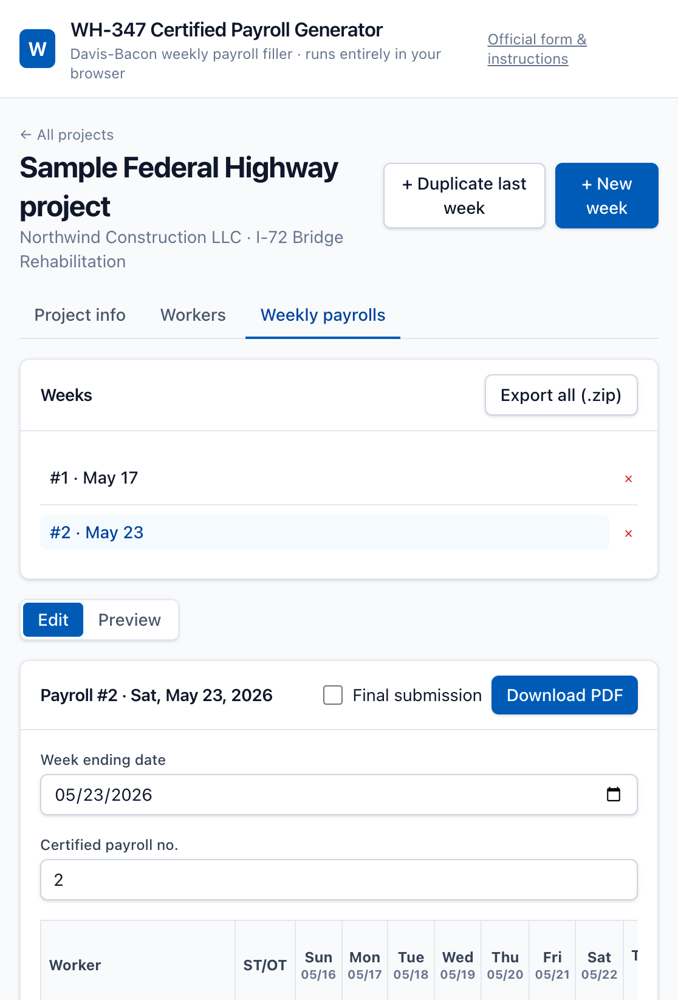
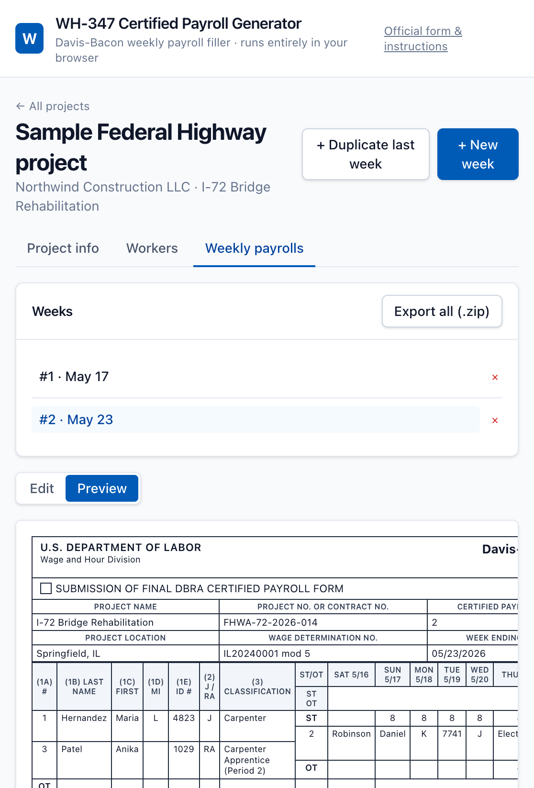

# govtooling2.github.io

Free, browser-based U.S. government form tooling. Static site, hosted on GitHub Pages.

## Tools

- **WH-347 Certified Payroll Generator** — fills the official U.S. Department of Labor [WH-347](https://www.dol.gov/agencies/whd/forms/wh347) Davis-Bacon weekly certified payroll form (Rev. January 2025) and downloads a print-ready PDF. Multi-week, multi-employee. All data stays in your browser (localStorage); nothing is uploaded anywhere.





## Features

- Multi-project, multi-week workspace, persisted to `localStorage`.
- Worker roster with classifications, journeyworker/apprentice flag, and last-4-of-SSN identifier.
- Week editor: grid of workers × 7 days with ST/OT hours, automatic gross / deduction / net totals.
- "Duplicate last week" action: bumps the certified payroll number and advances the week-ending date by 7 days, copying employees and rates forward.
- "Sign & download PDF": collects the Statement of Compliance (page 2 of WH-347), fills the official DOL PDF in-browser via [pdf-lib](https://pdf-lib.js.org/), and triggers a download.
- "Export all (.zip)": bundles every weekly payroll for a project into one downloadable archive ([JSZip](https://stuk.github.io/jszip/)).
- Import/export per-project JSON for backup or moving between machines.
- Calibration overlay PDF for visually diagnosing field-position issues.
- Live HTML preview that mirrors the WH-347 layout for fast in-browser QA.

## Tech

- Vite 7 + React 19 + TypeScript 6 + Tailwind CSS 4
- `pdf-lib` for coordinate-based fill of the official WH-347 PDF
- `jszip` for bulk weekly-PDF export
- `date-fns` for week math
- Deploy: GitHub Actions → GitHub Pages

## Local development

```bash
npm install
npm run dev
```

Open <http://localhost:5173>.

### Requirements

- Node.js 20.19+ or 22.12+ (Vite 7 / Tailwind 4 requirement). Older Node versions print a warning and may fail to start the dev server.

### Build

```bash
npm run build
npm run preview
```

### One-time PDF inspection

The official WH-347 PDF has no AcroForm fields, so this tool draws text at fixed coordinates over the form. If you ever want to inspect what is (or isn't) inside the PDF:

```bash
npm run inspect:pdf
# Writes public/wh347.fields.json
```

To regenerate a render of the form pages for coordinate calibration:

```bash
pdftoppm -r 144 -png public/wh347.pdf scripts/cal/wh347
pdftohtml -xml -hidden public/wh347.pdf scripts/cal/wh347
```

To produce a Node-side sample PDF without running the React app:

```bash
node scripts/buildSamplePdf.mjs
# Outputs scripts/cal/sample.pdf
```

## Deploy

Push to `main` and GitHub Actions ([.github/workflows/deploy.yml](.github/workflows/deploy.yml)) builds and publishes `dist/` to GitHub Pages.

The repository name is `govtooling2.github.io`, which makes this a user/organization site served from `https://govtooling2.github.io/`. Vite is configured with `base: '/'`. To host this as a project page elsewhere, change `base` in [vite.config.ts](vite.config.ts) to `/<repo-name>/`.

The first time you push, enable Pages in repo Settings → Pages, set source to **GitHub Actions**.

## How the PDF is filled

1. The unmodified DOL form PDF is bundled at `public/wh347.pdf`.
2. At runtime the app `fetch()`es that PDF, loads it via `pdf-lib`, and uses [`src/lib/pdf/wh347Layout.ts`](src/lib/pdf/wh347Layout.ts) to position text/checkboxes on top of the existing layout.
3. The resulting bytes are wrapped in a `Blob` and downloaded.

Because the form rendering is purely client-side, **no payroll data ever leaves the browser**.

### Calibrating coordinates

If a field on the downloaded PDF is misaligned for the version of the form you're working with, in the week editor click **"Coordinates look off? Download a calibration overlay"** to get a PDF with red bounding boxes around every anchor. Adjust the constants in [`src/lib/pdf/wh347Layout.ts`](src/lib/pdf/wh347Layout.ts) and rebuild.

## Disclaimer

This is a formatting tool, not legal advice. The contractor who signs the Statement of Compliance is responsible for the accuracy of the submitted payroll, and for compliance with the Davis-Bacon and Related Acts and 29 CFR Part 5.

The bundled `public/wh347.pdf` is the unmodified Department of Labor form from <https://www.dol.gov/agencies/whd/forms/wh347>. It is reproduced here only as a static asset so we can render text on top of it client-side; we do not modify the underlying form.
